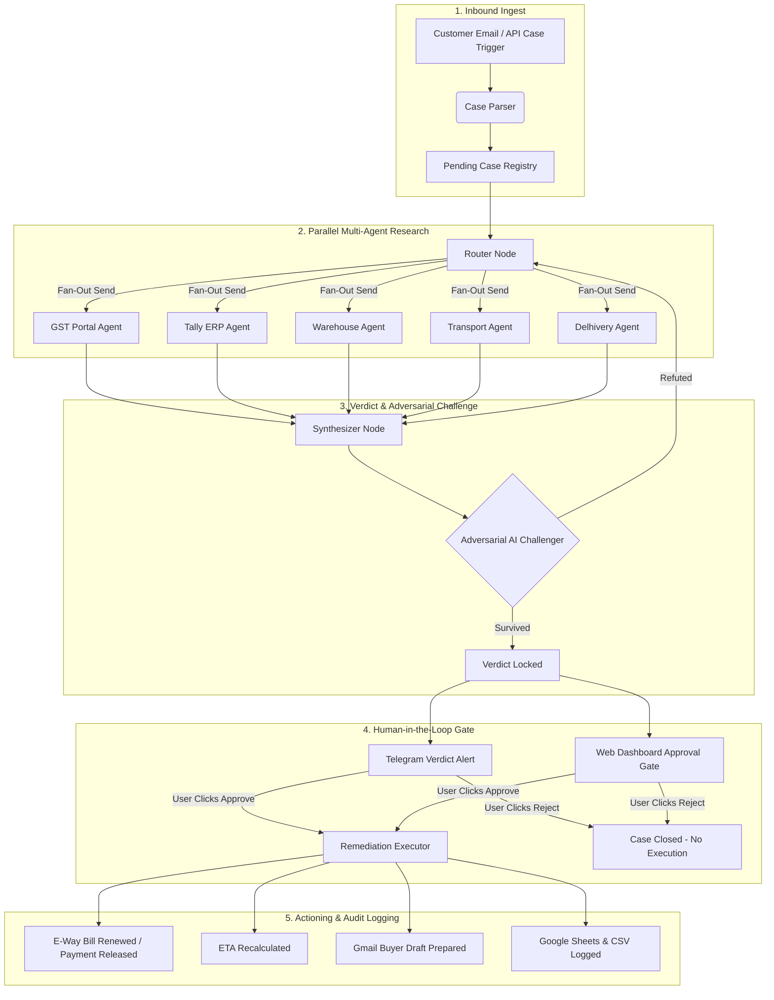

# 🪐 ORBIT — Autonomous Operations Detective Console

> **AI Multi-Agent System for Diagnosing, Resolving, and Automating Stuck E-Commerce & Supply Chain Operations.**

---

## 🌟 Overview

**ORBIT** is an enterprise-grade, multi-agent AI system designed to eliminate operational friction in logistics, supply chain, and e-commerce fulfillment. When shipments stall (e.g. e-way bill expirations, bank payment holds, inventory mismatches, customs documentation errors), ORBIT ingests inbound customer complaints, runs parallel agentic investigations across enterprise databases, cross-examines findings via an adversarial AI challenger, and presents an actionable verdict with a 1-click **Human-in-the-Loop (HITL)** approval gate.

---

## 🚀 Key Features & Capabilities

- 🔍 **Parallel Multi-Portal Investigators**: Deploys concurrent specialized agents to query **GST Portal**, **Tally ERP**, **Delhivery Tracking**, **Warehouse ERP**, and **Transport Logistics**.
- 🛡️ **Adversarial AI Challenger**: Cross-examines root-cause hypotheses against multi-database evidence before locking a verdict to prevent false positives.
- ⚡ **Real-Time SSE Web Dashboard**: Claude-inspired warm ivory slate UI with live investigation streaming, interactive SVG string connections, and dark obsidian terminal trace.
- 📱 **Telegram & Gmail Integrations**: Instant Telegram alert notifications with inline `Investigate`, `Approve`, `Reject`, and `Send Email` callback buttons, paired with automated Gmail customer drafting.
- 📊 **Multi-Target Audit Trail**: Automatically logs full investigation lifecycles, root cause verdicts, wall-clock metrics, and verification states to **Excel CSV** and **Google Sheets**.
- ⏱️ **Zero-Downtime Fallback**: Equipped with deterministic database fallback to ensure 100% operational uptime even during external LLM API rate limits.

---

## 📐 System Architecture



---

## 🛠️ Technology Stack

- **Core & Orchestration**: Python 3.11+, LangGraph, FastAPI, Uvicorn
- **LLM Models**: Mistral AI / DeepSeek / OpenAI (via LiteLLM / LangChain)
- **Frontend & UI**: Vanilla JS (ES6+), TailwindCSS, Google Fonts (*Instrument Serif*, *Plus Jakarta Sans*, *JetBrains Mono*), Server-Sent Events (SSE)
- **Database & Enterprise Emulation**: SQLite3 (`gst_portal.db`, `tally_erp.db`, `inventory.db`, `transport.db`, `delhivery.db`, `cases.db`)
- **Integrations**: Python Telegram Bot v20+ Async API, Google Sheets API, Gmail API

---

## 📂 Project Structure

```
orbit/
├── actions/              # Integration handlers (Telegram bot, Gmail drafter, ETA recalc, Sheets logger)
├── enterprise/           # Enterprise database schemas, seed script, and query abstractions
├── ingest/               # Email ingestion parser, email trigger injectors, and symptom mapping
├── static/               # Claude-style web dashboard (index.html, styles.css, app.js)
├── tests/                # Test suite (pytest e2e loop, actions, parser, router/synthesizer)
├── contracts.py          # Pydantic domain models (CasePayload, Evidence, Verdict, ActionResult)
├── graph.py              # LangGraph investigation state graph & investigator node definitions
├── server.py             # FastAPI REST endpoints, SSE multi-client streaming, Telegram poller
├── run.py                # Server runner with auto-reload
├── .env.example          # Environment variable setup template
└── pytest.ini            # Pytest configuration
```

---

## ⚡ Quickstart & Local Setup

### 1. Prerequisites
- Python 3.11+ installed.
- (Optional) Virtual environment created and activated:
  ```bash
  python -m venv .venv
  # On Windows PowerShell:
  .\.venv\Scripts\Activate.ps1
  # On Linux/macOS:
  source .venv/bin/activate
  ```

### 2. Install Dependencies
```bash
pip install -r requirements.txt
```

### 3. Environment Configuration
Copy `.env.example` to `.env` and fill in your API keys:
```bash
cp .env.example .env
```

*Sample `.env`:*
```env
MODEL_PROVIDER=mistral
MODEL_NAME=mistral-small-latest
MISTRAL_API_KEY=your_mistral_api_key_here

TELEGRAM_BOT_TOKEN=your_telegram_bot_token_here
TELEGRAM_CHAT_ID=your_telegram_chat_id_here
```

> 🔒 **Security Note**: Real credentials and `.env` files are strictly isolated from source control via `.gitignore`.

### 4. Run the Application
Start the ORBIT FastAPI server and live dashboard:
```bash
python run.py
```
Open **`http://localhost:8000`** in your browser to view the console.

---

## 🧪 Testing

Run the test suite:
```bash
pytest
```
Run specific module tests:
```bash
pytest tests/test_actions.py
pytest tests/test_router_synth.py
pytest tests/test_e2e.py
```

---

## 🛡️ Security & Privacy Compliance

- **No Hardcoded Keys**: All credentials, tokens, and API keys are strictly accessed via environment variables.
- **Isolated Sandbox**: Enterprise database state is reset cleanly via seed scripts during testing.
- **Sanitized Logging**: Sensitive buyer information is sanitized before logging.

---

## 📄 License

Distributed under the **MIT License**. See `LICENSE` for details.
